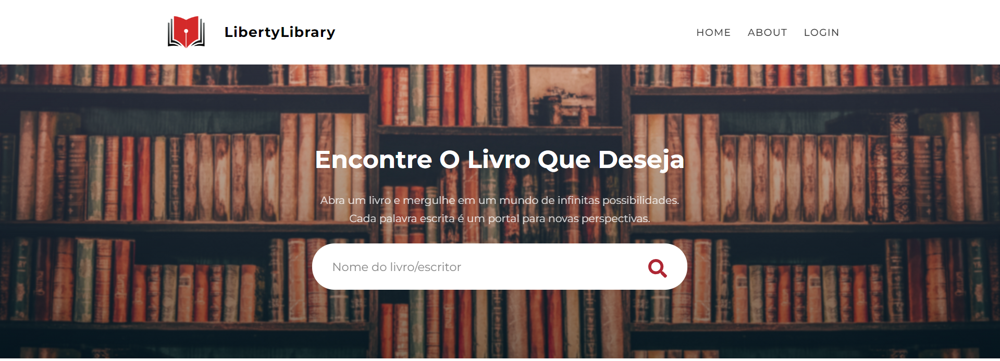
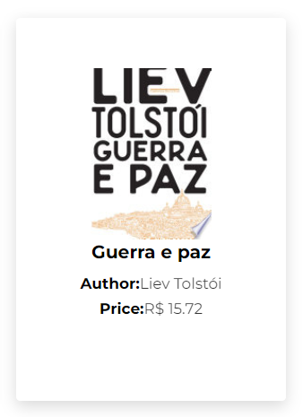
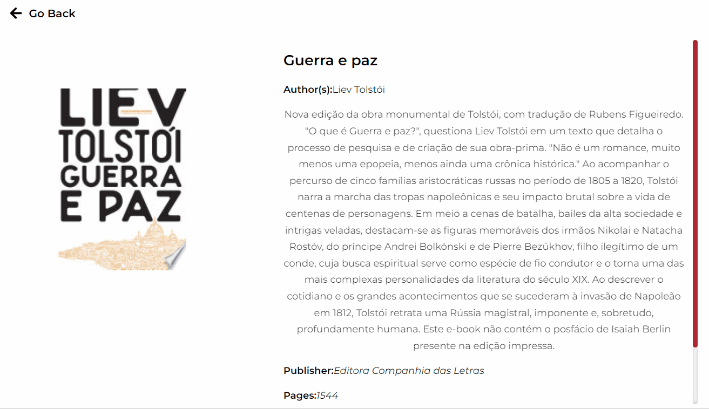
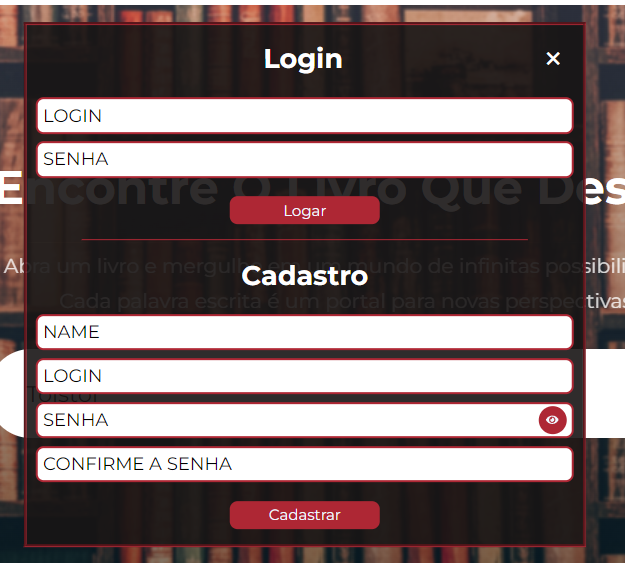
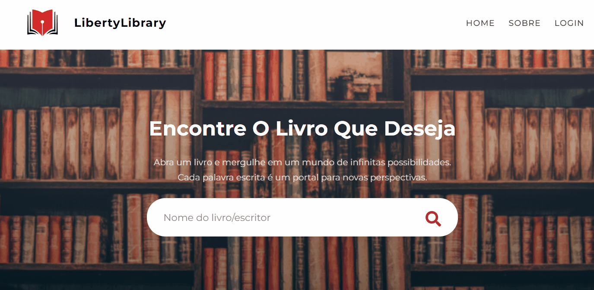
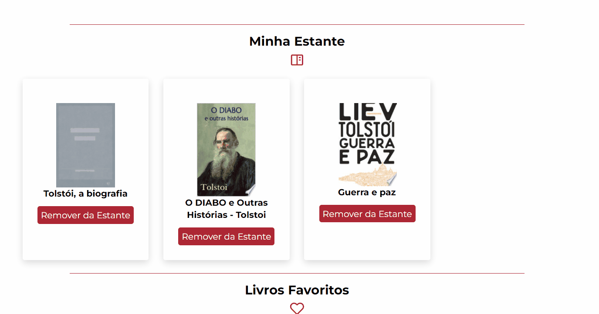

# FullStack Library Project 🚀

## LibertyLibrary 📚

    

        Este projeto pessoal foi meticulosamente concebido com o
        intuito exclusivo de ampliar e aprimorar as minhas competências no
        âmbito do desenvolvimento web. Trata-se de um projeto
        que consiste numa livraria e biblioteca
        virtual, proporcionando aos seus usuários uma experiência imersiva
        e enriquecedora.
    

    

        Por meio desta plataforma, os usuários têm a oportunidade não
        apenas de explorar uma vasta gama de obras literárias e seus
        respectivos autores, mas também de explorar uma série de
        recursos adicionais, como resumos detalhados, amostras de leitura
        prévia e muito mais. Além disso, os usuários são incentivados a
        criar uma conta pessoal, onde poderão catalogar e organizar
        as obras que desejam ler, já leram ou que se tornaram seus
        favoritos.
    

    
 
        O desenvolvimento do <b>LibertyLibrary</b> foi conduzido com a utilização
        criteriosa e estratégica  da <b>Google Books API</b> e de algumas das mais renomadas ferramentas
        e tecnologias disponíveis no panorama do desenvolvimento web, incluindo <b>React</b> para a interface do usuário, <b>Node</b> com <b>Express</b>
        para o desenvolvimento da API no backend e <b>MySQL</b> com <b>Sequelize</b> para o gerenciamento do banco de
        dados.
    

## Preview 🗺️

### Home 🏠

    
Na Home do projeto, temos um heading que contém a logo e um menu simples de navegação. Logo abaixo, o campo de pesquisa onde o usuário deve inserir alguma palavra-chave como nome de um livro, nome de um autor, ou algo relacionado ao que deseja encontrar.

  
Abaixo vemos uma demonstração de como funciona o mecanismo de pesquisa e navegação do site. O usuário digita "Tolstoi" no campo de pesquisa e como resultado temos uma lista com obras do autor e de comentadores. Em cada item também há informações adicionais de autor e preço ('Author' e 'Price'). Além disso, clicando no item, o usuário é redirecionado para uma rota na qual obtém outras informações detalhadas a respeito da obra selecionada, bem como o nome da editora responsável pela publicação, o ano, preço e um link onde, ao clicar, terá acesso a uma prévia da versão online da mesma.

 
 

### Usuário 🧑‍💻

  
Para melhorar a experiência do usuário, foi desenvolvido um sistema de login de usuários que funciona como uma estante virtual onde os mesmos podem criar as suas próprias listas de livros que desejam ler, já lidos e favoritos.

A partir do momento em que o usuário faz o cadastro ou login na sua conta, cada um dos itens de livros retornados pelas buscas recebe um botão com o qual o usuário poderá adicioná-lo ou removê-lo da estante. O mesmo ocorre com os itens que estão entre as listas do usuário.

Abaixo vemos o usuário realizando a exclusão dos livros da sua estante virtual e fazendo o logout da conta (pode-se notar que o botão de 'Login' foi substituído por dois botões 'User' e 'Logout' enquanto o usuário está logado. Ambos voltam a dar lugar ao botão 'Login' assim que o usuário desloga da sua conta.).

 
 

### Mobile 📱

    

 
 

### Tecnologias 🛠️

Segue algumas das principais tecnologias utilizadas para o desenvolvimento deste projeto:

- ReactJS
- NodeJS
- MySQL
- Sequelize
- Google Books API

### Contato 📳

- [Portfólio](https://portfolio-markshenrik.vercel.app/)
- [LinkedIn](https://www.linkedin.com/in/markshenrik/)
- [WhatsApp](https://api.whatsapp.com/send?phone=5579998511403)
- [Email](mailto:markshenrik13@gmail.com)
- [LibertyLibrary](https://react-libraty-google-api.vercel.app/)
